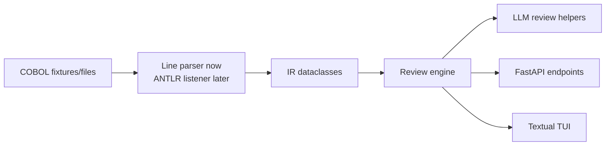

# Punchcard

Punchcard is a workbench for reading legacy COBOL, building a small intermediate representation (IR), and preparing focused static/LLM-assisted reviews. 

## Setup

This project targets Python 3.12 and uses [`uv`](https://docs.astral.sh/uv/) for dependency management.

```bash
uv sync --dev
uv run pytest
uv run punchcard fixtures/hello.cbl
```

If you prefer a temporary shell:

```bash
uv venv --python 3.12
source .venv/bin/activate
uv pip install -e '.[dev]'
```

## MVP architecture



### Package map

| Path | Purpose |
| --- | --- |
| `punchcard/backend/parser/` | COBOL parsing and IR models. |
| `punchcard/backend/llm/` | Anthropic-backed review helpers, later with prompt templates and guardrails. |
| `punchcard/backend/review/` | Static checks and orchestration. |
| `punchcard/backend/api/` | FastAPI boundary for services and UI clients. |
| `punchcard/tui/` | Textual terminal UI. |
| `fixtures/` | Small COBOL examples for repeatable parser work. |
| `tests/` | Pytest suite. |

Like a beit midrash, the architecture keeps arguments close to sources: parser nodes retain line numbers, and review output should cite the code it discusses.

## Supported COBOL verbs in the line parser

The current parser records any procedure statement's first token as the verb. The MVP fixture and review path are expected to focus on these verbs first:

| Verb | MVP status | Notes |
| --- | --- | --- |
| `DISPLAY` | Parsed | Captured as a statement with tokens and line number. |
| `MOVE` | Parsed | Captured as a statement; semantic data-flow analysis is future work. |
| `STOP` | Parsed | `STOP RUN.` is treated as a statement, not a paragraph. |
| `PERFORM` | Recognized generically | Parsed when present, but no control-flow graph yet. |
| `IF` | Recognized generically | Parsed when present, but multi-line block structure is not modeled yet. |
| `READ` / `WRITE` | Recognized generically | Parsed when present; file metadata is not linked yet. |
| `CALL` | Recognized generically | Parsed when present; external dependency inventory is future work. |

## Known limitations

* The parser is conservative and line-based. It is intentionally not a full COBOL grammar yet.
* Multi-line statements are not joined.
* Copybooks, dialect-specific syntax, and compiler directives are not expanded.
* DATA DIVISION entries are retained as raw lines and section names, not typed data declarations.
* PROCEDURE DIVISION nesting is shallow: sections, paragraphs, and one-line statements are captured, but no full control-flow graph exists yet.
* Security posture for future API/LLM work: never send proprietary COBOL to an external model without explicit user approval, redaction policy, and audit logging. As Pirkei Avot might nudge us: build a fence around sensitive data.
