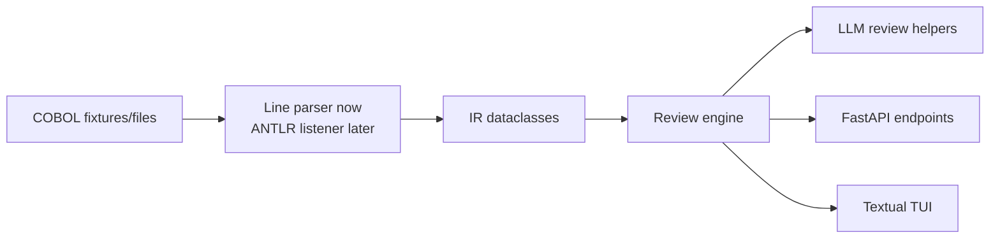

# Punchcard

Punchcard is a workbench for reading legacy COBOL, building a small intermediate representation (IR), and preparing focused static/LLM-assisted reviews. 

## Setup

This project targets Python 3.12 and uses [`uv`](https://docs.astral.sh/uv/) for dependency management.

```bash
uv sync --dev
uv run pytest
uv run punchcard fixtures/hello.cbl
```

If you prefer a temporary shell:

```bash
uv venv --python 3.12
source .venv/bin/activate
uv pip install -e '.[dev]'
```

Lint with `uv run ruff check .`. The same checks (ruff, a compile check, and the
test suite) run in CI on every pull request via `.github/workflows/ci.yml`.

## LLM integration

Translation goes through a small `LLMClient` seam (`punchcard/backend/llm/`):

* By default `get_llm_client()` returns the offline `MockLLMClient`, so tests,
  CI, and local runs never touch the network.
* When `ANTHROPIC_API_KEY` is set (and the process is not under test), it returns
  the real `AnthropicTranslationClient`, which calls Claude (`claude-opus-4-8`,
  adaptive thinking) using the templates in `llm/prompts.py`.

Each paragraph carries a structural **confidence score** from
`llm/confidence.py` (GO TO, ALTER, external CALL, file I/O, and DATA DIVISION
REDEFINES each subtract an explainable penalty; below 0.6 a paragraph is flagged
`MANDATORY_REVIEW`) and a **cyclomatic complexity** estimate from
`parser/complexity.py`.

### Review API (FastAPI)

```
POST /sessions                                   # upload a .cbl/.cob file
GET  /sessions/{id}                              # status + progress
GET  /sessions/{id}/paragraphs                   # per-paragraph status, confidence, risk flags
GET  /sessions/{id}/paragraphs/{name}            # one paragraph's source + translation
POST /sessions/{id}/paragraphs/{name}/translate  # translate one paragraph
POST /sessions/{id}/paragraphs/{name}/accept     # accept a rewrite
POST /sessions/{id}/paragraphs/{name}/reject     # reject a rewrite
GET  /sessions/{id}/export                       # translated output + JSON audit log
GET  /sessions/{id}/export/file                  # download the assembled module
```

### Review interfaces

Two front-ends drive the same review workflow:

* **Terminal UI** — `uv run punchcard-tui --source program.cbl` (Textual).
* **Web UI** — a React + Vite app in `frontend/`. Build it (`cd frontend && npm install && npm run build`) and run `uv run punchcard-web` to serve the UI and API together; see `frontend/README.md` for the hot-reload dev workflow.

## MVP architecture



### Package map

| Path | Purpose |
| --- | --- |
| `punchcard/backend/parser/` | COBOL parsing, IR models, and complexity scoring. |
| `punchcard/backend/llm/` | Anthropic-backed translation client, prompt templates, and confidence scoring. |
| `punchcard/backend/review/` | In-memory rewrite-review service shared by the API and TUI. |
| `punchcard/backend/api/` | FastAPI boundary for services and UI clients. |
| `punchcard/tui/` | Textual terminal UI. |
| `frontend/` | React + Vite web UI (served by FastAPI once built). |
| `fixtures/` | Small COBOL examples for repeatable parser work. |
| `tests/` | Pytest suite. |

the architecture keeps arguments close to sources: parser nodes retain line numbers, and review output should cite the code it discusses.

## Parsing

COBOL is parsed with the [grammars-v4](https://github.com/antlr/grammars-v4/tree/master/cobol85)
COBOL85 grammar via ANTLR (vendored under `parser/_generated/`, so no Java is
needed at runtime). The parse tree is walked into a small structured IR: each
statement records its verb, source span, and any nested statements (the bodies of
`IF`/`EVALUATE` and inline `PERFORM`).

`COPY`/`REPLACE` are expanded first by a preprocessor (also ANTLR-grammar-based);
copybooks are resolved from a search path:

```bash
uv run punchcard program.cbl --copybook-path ./copybooks
```

Each procedure statement is recorded with its leading verb. The review path
focuses on these verbs first:

| Verb | MVP status | Notes |
| --- | --- | --- |
| `DISPLAY` | Parsed | Captured as a statement with tokens and line number. |
| `MOVE` | Parsed | Captured as a statement; semantic data-flow analysis is future work. |
| `STOP` | Parsed | `STOP RUN.` is treated as a statement, not a paragraph. |
| `PERFORM` | Recognized generically | Parsed when present, but no control-flow graph yet. |
| `IF` | Recognized generically | Parsed when present, but multi-line block structure is not modeled yet. |
| `READ` / `WRITE` | Recognized generically | Parsed when present; file metadata is not linked yet. |
| `CALL` | Recognized generically | Parsed when present; external dependency inventory is future work. |

## Known limitations

* `COPY` is expanded inline, so IR line numbers refer to the expanded source. Each copied line's originating copybook is tracked (`CobolProgram.copy_spans` / `origin_of`), except when a program-level `REPLACE`/listing directive shifts lines, in which case provenance is omitted.
* `COPY ... REPLACING` / `REPLACE` substitution is word/pseudo-text based and does not implement the full COBOL token-matching rules.
* DATA DIVISION entries are retained as raw lines and section names, not typed data declarations.
* PROCEDURE DIVISION nesting captures block statements as nested children, but there is no full control-flow graph yet.
* Security posture for API/LLM work: real translation only runs when `ANTHROPIC_API_KEY` is set (otherwise a local mock is used); never send proprietary COBOL to an external model without explicit user approval, redaction policy, and audit logging.
